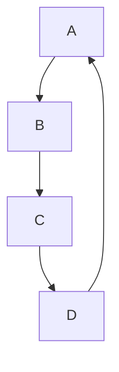

#Morden Java 01 <Java8>

## Functional Style Programming

#### Function이란? 
크게 두가지로 볼 수 있음 C언어의 입장에서 Function과 JAVA의 입장에서 Function 
- C언어 : 함수라고 부르는 main함수를 제외한 다른 함수 {} 블럭과 블럭 사이의 그거! 
``` 
int add(int a, int b){
    return a + b; 
}
int main(){
    int a = 10;
    int b = 10; 
    printf(" a + b : %d", add(a,b));
} 
```
(또한 절차적으로 진행이 됨)

-JAVA : 수학적 의미에서의 함수와 같음 `intput -> output`의 관계 `A -> 10 `이라는 함수가 있을 때 동일한 입력값에 대해서는
결과 값이 항상 같고 결과는 항상 1개인 관계 -> Side Effect가 없다(자판기)
 
 #### Immutablility (불변성)
 
- OOP(명령형) : `int n = 10;`이라고 되어 있는 상태에서 `n = 100;`으로 수정하였을 때 기존의 `int n = 10;`에서 10은 폐지가 되고 
  `n = 100;`으로 덮어쓰기가 된다. 
- Functional Programming(선언형) : `int n = 10;` 인 코드는 이를 정의하는 개념이라 한 번 정해진 값은 변하지 않는다(바꿀 수 없다?)
    그렇기 때문에 교체를 하는 방식으로 사용한다.


## 그래서 함수형 프로그래밍이 뭔데?
: `부수효과`를 없애고 `순수 함수`를 만들어 모듈화 수준을 높이는 프로그래밍 패러다임

`부수효과` : 주어진 값 이외의 외부 변수 및 프로그램 실행에 영향을 끼치지 않아야 된다는 의미 ==> 만족하는 함수를 `순수 함수`라고 함
```
private String name = "호랑이";

// not Pure
public String greeting(){
    return name + "어흥";
}

//Pure
public static String greeting(String name){
    return name + "어흥";
}
```

Stream API를 이용한 예시 ) 
```

List<String> myList = Arrays.asList("c1", "a2", "b3", "4", "5");

//기존 방식 데이터를 어떻게 처리할지 명령을 통해 풀어나감
for(int i = 0; i < myList.size(); i++){
    String s = myList.get(i);
    if(s.startsWith("c")){
        System.out.println(s.toUpperCase());
    }
}

//Stream API를 공부하진 않았지만 
// 선언적 함수를 통해 무엇을 풀어나갈지 결정 
myList.Stream()
    .filter(s -> s.startWith("c))
    .map(String :: toUpperCase)
    .forEash(System.out::println);
```
어떻게 보면 Stream으로 임시 타입 변경해서 메소드 떡칠 같은 느낌..

## 1급 객체란
> 특정 언어의 일급 객체(first-class citizens, 1급 값, 1급 엔티티, 1급 시민)이라 함은 컴퓨터 프로그래밍 언어 디자인에서 일반적으로 다른 객체들에 적용 가능한 연산을 모두 지원하는 객체를 가리킨다.   
> 
> 1급 객체(First class object)란 다음과 같은 조건을 만족하는 객체이다
> - `변수나 데이터 구조안에 담을 수 있다.`
> - `파라미터로 전달할 수 있다.`
> - `반환값(return valure)으로 사용할 수 있다.`
> - 할당에 사용된 이름과 관계없이 고유한 구별이 가능하다.
> - 동적으로 프로퍼티 할당이 가능하다.
> - 기존 데이터의 불변성

==> Java 8이후로 람다 표현식이 도입되어 이전보다 함수적인 스타일을 지원하기 시작 -> 메소드를 일급 객체처럼 다룰 수 있는 기능이 추가 

## 함수형 인터페이스 
- 1개의 추상 메소드를 갖는 인터페이스 
- java 8부터 인터페이스는 기본 구현체를 포함한 디폴트 메소드를 포함 할 수 있음 
- 여러개의 디폴트 메서드가 있더라도 추상 메서드가 오직 하나면 함수형 인터페이스임 
- 함수형 인터페이스는 선언시 명시적으로 어노테이션 (@FunctionalInterface)을 통해 함수형 인터페이스라는 것을 명시할 수 있다.  
  
```java
//함수형 인터페이스 예시 
@FunctionalInterface
interface MyRunnable{
    void run();
}

public class FunctionalTest implements MyRunnable{
    //함수형 인터페이스 구현체 
    @Override
    public void run() {
        System.out.println("Hello World");
    }
    public static void main(String[] args) {
       FunctionalTest test = new FunctionalTest();
       test.run();
    }
}

```
- 하지만 위의 구현체를 단발성으로 사용하고 싶을 때 위와 같이 생성하면 코드가 지저분해짐 
- 이것을 방지하고자 `익명 클래스`를 사용하기도 함


## 익명 클래스
- 이름이 없는 클래스
- 클래스의 정의와 동시에 인스턴스를 생성하여 사용함
- 인터페이스를 구현하거나 추상 클래스를 상속 받는 작은 구현체를 생성할 때 사용됨
```java
@FunctionalInterface
interface MyRunnable{ //함수형 인터페이스
    void run();
}

public class FunctionalInterfaceTest implements MyRunnable{
    @Override
    public void run() { // 함수형 인터페이스를 구현 구현체
        System.out.println("Hello World");
    }
    public static void main(String[] args) {
       FunctionalInterfaceTest test = new FunctionalInterfaceTest();
       test.run(); // 인터페이스 구현체 실행

       MyRunnable test2 = new MyRunnable() { //익명 클래스로 인터페이스 구현 
           @Override
           public void run() {
               System.out.println("Goodbye World");
           }
       };
       test2.run();

        MyRunnable test3 = ()-> System.out.println("Goodbye World"); //람다식으로 변경 

    }
}


```
  안드로이드 개발에서 부터 함수형 프로그래밍을 자주 사용하기 시작했다?  
  -> 기능별로 중점적으로 개발, 하지만 하나 하나 객체를 만들어서 따로 파일을 빼는 행위는 비효율적 -> 함수형 프로그래밍 도입 -> 아 근데 뭐 이렇게 기냐? -> 람다식 등장


## 람다 

- 람다는 무명 클래스로 메소드 하나짜리 객체를 매번 정의해야 하는 상황에서 태어남 
- (매개변수) -> {메소드 실행문} 이지만 
- 매개변수가 하나이면 소괄호 생략 가능
- 메소드 실행문이 return 한 문장이면 중괄호와 return 키워드 생략 가능


### 람다식 이해하기 

```java
//코드 내의 불필요한 (노이즈)를 제거한다고 생각하면 됨
new Comparartor<Product>(){
    @Override
    public int compare(Produnct p1, Product p2){
        return p1.getPrice().compareTo(p2.getPrice());
    }
};
// >>> 
(Product p1, Product p2){
    return p1.getPrice().compareTo(p2.getPrice());
}
// >>>
(Product p1, Product 2) -> {
    return p1.getPrice().compareTo(p2.getPrice());
}
// >>> 
(p1,p2) -> p1.getPrice().compareTo(p2.getPrice());

```
표현 방법
```java 
//1)
(User user) -> user.getName();
//>>
user -> user.getName();

//2)
()->"Unknown";

//3)
user->sout("Hello" + user);

``` 

```java
Arrays.sort(students,(o1,o2) ->{
    int num = 100; 
    //람다도 하나의 메소드라서 안에서 필요한 변수 만들어 쓰는건 OK
    sout("이름으로 정렬중!");
    student = new Student[10]; 
    // 이건 안돼 밖에 있는 데이터는 변경 X 
    //근데 또 클래스 멤버면 가능 , 객체 안에 계속 유지되는 변수 가능..
    return o1.getName().compareTo(o2.getName());
});
```


## Closure
- 클로저란 함수를 그 환경과 함께 저장한 레코드를 말함  
  *위키피디아
- 클로저는 함수와 그 주변 상태에 대한 참조 조합  
  *MDN문서 자바스크립트의 클로저


- `내부함수가 외부함수의 맥락(context)에 접근할 수 있는 것을 뜻한다.`
- 외부함수안에 있는 내부함수가 외부 함수의 지역 변수를 사용할 수 있는 것 
- 외부함수가 종료되도 내부함수에서 참조하는 외부함수의 context는 유지된다 
```java
int a = 3;
i -> i+a; 
```

### 자유 변수(free variable)
- 람다식 내에서 정의되지 않고, 또 파라미터로도 전달되지 않은 외부 Local variable를 참조하는 변수를 말한다.

```Java
public class Closure  {
    public static void main(String[] args) {
        int a = 3; // 자유변수
        Test test = new Test() {
            @Override
            public int run(int n) {
                //a = 2;  //에러
                return n + a;
            }
        };

        Test test = i -> i + a;
        System.out.println(test.run(11)); // 결과 14
    }

}

interface Test{
    int run(int n);
}

```


## Steam API

어떠한 입력 데이터(생성된 스트림)를 가지고 필요한 과정을 거치면서 아웃풋 데이터를 생성 -> 그 과정에서 원본을 변경하지는 않음 -> 원하는 데이터를 생성 

==> 일회용, 내부 반복으로 작업 

```
 String [] names = {"yangyu", "yechan", "hyunsub", "minwoo"};
 List<String> list = Arrays.asList(names);

 Stream<String> arrStream = Arrays.stream(names); //배열에서 스트림 생성해내기
```
240725작성


  [출처]

[YouTube](https://www.youtube.com/watch?v=lIEKOe0bh0M&t=10s/)

[T-story1](https://warpgate3.tistory.com/entry/%EC%9E%90%EB%B0%94%EC%BD%94%EB%93%9C%EB%A1%9C-%EB%B3%B4%EB%8A%94-%ED%95%A8%EC%88%98%ED%98%95-%ED%94%84%EB%A1%9C%EA%B7%B8%EB%9E%98%EB%B0%8D-Functional-Programming-in-Java/)

[T-stroy2](https://swiftymind.tistory.com/108/)


