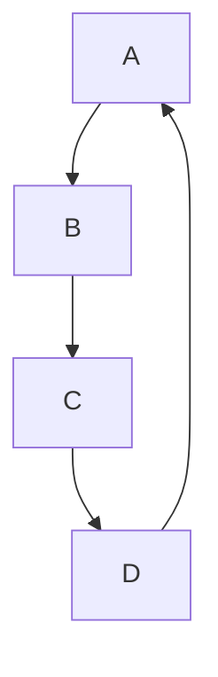

#Morden Java 01 <Java8>

## Functional Style Programming

#### Function이란? 
크게 두가지로 볼 수 있음 C언어의 입장에서 Function과 JAVA의 입장에서 Function 
- C언어 : 함수라고 부르는 main함수를 제외한 다른 함수 {} 블럭과 블럭 사이의 그거! 
``` 
int add(int a, int b){
    return a + b; 
}
int main(){
    int a = 10;
    int b = 10; 
    printf(" a + b : %d", add(a,b));
} 
```
(또한 절차적으로 진행이 됨)

-JAVA : 수학적 의미에서의 함수와 같음 `intput -> output`의 관계 `A -> 10 `이라는 함수가 있을 때 동일한 입력값에 대해서는
결과 값이 항상 같고 결과는 항상 1개인 관계 -> Side Effect가 없다(자판기)
 
 #### Immutablility (불변성)
 
- OOP(명령형) : `int n = 10;`이라고 되어 있는 상태에서 `n = 100;`으로 수정하였을 때 기존의 `int n = 10;`에서 10은 폐지가 되고 
  `n = 100;`으로 덮어쓰기가 된다. 
- Functional Programming(선언형) : `int n = 10;` 인 코드는 이를 정의하는 개념이라 한 번 정해진 값은 변하지 않는다(바꿀 수 없다?)
    그렇기 때문에 교체를 하는 방식으로 사용한다.


#### 그래서 함수형 프로그래밍이 뭔데?
: `부수효과`를 없애고 `순수 함수`를 만들어 모듈화 수준을 높이는 프로그래밍 패러다임

`부수효과` : 주어진 값 이외의 외부 변수 및 프로그램 실행에 영향을 끼치지 않아야 된다는 의미 ==> 만족하는 함수를 `순수 함수`라고 함
```
private String name = "호랑이";

// not Pure
public String greeting(){
    return name + "어흥";
}

//Pure
public static String greeting(String name){
    return name + "어흥";
}
```

Stream API를 이용한 예시 ) 
```

List<String> myList = Arrays.asList("c1", "a2", "b3", "4", "5");

//기존 방식 데이터를 어떻게 처리할지 명령을 통해 풀어나감
for(int i = 0; i < myList.size(); i++){
    String s = myList.get(i);
    if(s.startsWith("c")){
        System.out.println(s.toUpperCase());
    }
}

//Stream API를 공부하진 않았지만 
// 선언적 함수를 통해 무엇을 풀어나갈지 결정 
myList.Stream()
    .filter(s -> s.startWith("c))
    .map(String :: toUpperCase)
    .forEash(System.out::println);
```
어떻게 보면 Stream으로 임시 타입 변경해서 메소드 떡칠 같은 느낌..

#### 1급 객체란
> 특정 언어의 일급 객체(first-class citizens, 1급 값, 1급 엔티티, 1급 시민)이라 함은 컴퓨터 프로그래밍 언어 디자인에서 일반적으로 다른 객체들에 적용 가능한 연산을 모두 지우너하는 객체를 가리킨다.   
> 
> 1급 객체(First class object)란 다음과 같은 조건을 만족하는 객체이다
> - 변수나 데이터 구조안에 담을 수 있다.
> - 파라미터로 전달할 수 있따.
> - 반환값(return valure)으로 사용할 수 있따.
> - 할당에 사용된 이름과 관계없이 고유한 구별이 가능하다.
> - 동적으로 프로퍼티 할당이 가능하다.
> - 기존 데이터의 불변성

  

  [출처]

[YouTube](https://www.youtube.com/watch?v=lIEKOe0bh0M&t=10s/)

[T-story1](https://warpgate3.tistory.com/entry/%EC%9E%90%EB%B0%94%EC%BD%94%EB%93%9C%EB%A1%9C-%EB%B3%B4%EB%8A%94-%ED%95%A8%EC%88%98%ED%98%95-%ED%94%84%EB%A1%9C%EA%B7%B8%EB%9E%98%EB%B0%8D-Functional-Programming-in-Java/)

[T-stroy2](https://swiftymind.tistory.com/108/)


## 람다식 
