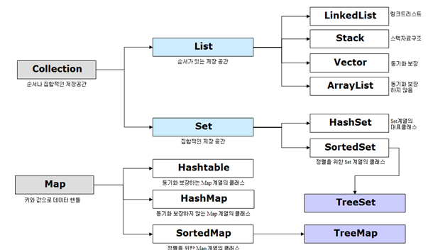

## 디지털 통신 

- Analog : 자연적인 상태에서 나타나는 연속적인 값
- Digital : 0과 1의 조합으로 부호화 된 신호로 정보를 표현 

  #### 디지털 데이터 통신의 이점 
  - 정보 손실이 적음
    - 자가 오류 정정이 가능한 기법 도입 가능
      - 이게 가능해?
    - 잡음에 대해 강건성이 높다 
      - 왜 높을까..?
    - 신호 지연 및 손실 보완 가능 
  - 매체를 `다중화`하여 대역폭 활용도 높일 수 있따.
  - 정보의 `암호화` 용이

## 데이터 전송 방식의 분류 

- 직렬전송 (Serial Communitcation) : 직렬로 그냥 빠르게 욱여 넣기 가능 ex) usb
- 병렬전송 (Parallel Communication) : 세로로 타이밍이 맞춰서 전송해야됨 다소 느리겠지만 

  - 이 둘의 차이점 ? 뭐가 어떻게 좋고 그런거 추가로 검색

- 동기식 전송(Synchronous Transimission)
  - 타이밍 제어 신호와 데이터 신호를 동기화
  - 고속 통신에 유리
- 비동기식 전송(Asynchronous Transimission)
  - 하나의 통신선을 이용하여 제어 비트(Start bit, Stop bit)와 데이터 비트 전송
  - 하드웨어 비용이 낮은 편 

#### 전송 방향에 따른 분류

- 단방향(simplex) 전송
- 반이중(half duplex) 전송
- 전이중(full duplex) 전송
  
#### 회선 접속 방식에 따른 분류
- 점대점 (point-to-point configuration) 
  - 서로 다른 두 장치가 전용 회선을 이용하여 연결
  - ex : 블루투스, 
  - 
- 다지점(multipoint-configuration)
  - 하나의 통신 회선에 여러 개의 장치가 연결
  - 이더넷 
  - 

#### 망 구성 범위에 따른 분류
- LAN(Local-Area_Network) 근거리 통신망
  - 집, 사무실, PC방 등 주로 단일한 네트워크로 구성
- MAN(Metropolitan Area Network) 도시 지역 통신망 
  - 여러 LAN을 연결한 도시 하나 정도의 네트워크 단위
- WAN(Wide Area Network) 광역 통신망
  - 근거리 통신망을 벗어나는 경우 모두 WAN영역으로 보는 견해
  - MAN은 LAN이 모여 이루어지고 WAN은 MAN이 모여 이루어진 것이라는 견해 

## OSI 7-계층 모델 
- 표준 프로토콜을 사용하여 다양한 시스템이 통신할 수 있도록 국제표준화기구(OSI)에서 제정한 개념 모델
  - 

#### OSI 1계층 : Physical 
- 매체 : 쉽게 물리적으로 망을 설계하는 단계라고 보면 됨 
  - 학교 망 설계중 몇대의 컴퓨터를 설치할 예정이고 그럴려고 하면 몇개의 LAN케이블(UTP-6)필요한가 -> 허브 설치 등등... 
- 리피터 : 증폭기 
  
#### OSI 2계층 : Data Link
- 스위칭 허브 (Switching Hub)
  - 연결 장치간 스위칭 역할을 수행
  - 하나의 LAN을 여러 병렬 회선 형태로 세그먼트 화 
- 브릿지 (Bridge)
  - 복수의 LAN을 서로 연결하기 위하여 이용
  - 전체 네트워크의 노드 수 및 거리 확장
- 이더넷 (Ethernaet) -IEEE 802.3
  - 모든 장치는 고유의 MAC주소를 가짐
  - 데이터 전송에 있어 발생하는 충돌(Collision) 을 감지하고 제어하는 기법을 정의 
- 와이파이 (Wi-Fi) - IEEE 802.11
  - 이더넷과 동일한 형태의 MAC 주소를 사용
  - 주로 2.4 GHz, 5GHz의 주파수를 가지는 무선 통신을 이용
  - 충돌 회피 

#### 이더넷의 다중 접근 제어
- CSMA/CD (Carrier-Sense Multiple Access With Collision Detection)  
  : 충돌 감지 제어 기법
  - 노드(또는 호스트) 는 데이터 전송 이전에 회선이 사용 중인지 점검
  - 회선이 사용 중이라면 임의의 시간만큼 기다린 뒤 다시 시도 
  - 회선이 사용 중이 아님이 확인 되면 데이터 전송 시작
  - 데이터 전송 중 `충돌이 검출`되면 충돌 발생 사실을 모든 노드에게 통보
  - 충돌이 발생하면 `임의의 시간 동안 대기`(Exponential back off)한 후 다시 시도 

#### 무선 랜의 다중 접근 제어
- CSMA/CA (Collision Avoidace)  
: 충돌 회피 기법
- RTS(Requset to Send)와 CTS(Clear to Send)를 이용하여 어느 순간이든 허락된 한 쌍의 노드를 사이에서만 데이터 전송 (매체 이용)이 이루어지도록 함
- 누군가 사용중이면 충돌을 피하기 위해 허락을 구함..쭈글모드..

#### 흐름제어(Flow Control)
- 슬라이딩 윈도우(Sliding window) 프로토콜
  - `송신측`에서는 매 프레임에 순차번호 (sequence number)를 매김
  - 순차 번호 및 오류 검출 코드 등을 프레임에 표기하고 순서대로 전송
  - `수신측`에서는 매 프레임에 대한 응답(ACK)프레임으로 회신
  - 받기 성공 `ACK` 받기 실패 `NAK`
  - 슬라이딩 윈도우 - 송신측에서 응답을 받지 않고도 연속하여 전송할 수 있는 프레임 개수에 대한 제한  
  ==> 윈도우의 크기에 따라 ACk를 받지 않고 일단 전송 -> ACK후 다른 내용 전송 
  

#### 오류 검출(Error DEtection)
- 패러티 비트(Parity Bit)
  - 가장 간단한 형태의 오류 검출 코드
  - 오류발생 가능성이 작은 경우에는 패리티비트 하나만 붙여서도 검출 가능 
  - 매체가 불안정하거나 에러 확률이 높은 경우, 데이터가 중요한 경우 적합하지 않음
- 체크섬(Checksum)
  - ??
  - CRC 

#### 프로토콜과 프로토콜 스택 
- 프로토콜(Protocol)
  - 서로 다른 컴퓨터 사이에 데이터를 주고 받기 위한 약속
    - 서로 다른 컴퓨터들은 이용하는 하드웨어, 데이터의 표현등이 다를수 있으므로 표준 프로토콜을 정하고 서로 대화할 때 이 `규약`을 따를 필요가 있음
    - 주소 지정, 데이터 흐름제어, 연결 제어, 캡슐활, 다중화 등의 방식을 규정
- 프로토콜 스택(Protocol Stack)
  - 프로토콜들을 구체화해서 단계별로 쌓아 나아가는 것 

| Application  | - End User Layer - HTTP, FTP, IRC, SSH, DNS                    |
|--------------|----------------------------------------------------------------|
| Presentation | - Syntax Layer - SSL, SSH, IMAP, FTP, MPEG, JPEG               |
| Session      | - Synch & Send To Port - API's Sockets, WinSock                |
| Transport    | - End-to-end Connetions - TCP, UDP                             |
| Network      | - Packets - IP, ICMP,IPSec, IGMP                               |
| Data Link    | -Frames -Ethernet, PPP, Switch, Bridge                         |
| Physical     | - Physical Structure - Coax, Fiber, WireLess, Hubs, Repeaters  |

## 인터넷 주소 체계 
IP 주소 : 
- 4byte로 이루어져 있음
- 각 바이트에 표현된 수 사이에 점을 찍어 구분 
- 
- Net ID : 어느 네트워크에 속해있는가?
- Host ID : 네트워크 안에서 어느 호스트에 속하는가?

## 포트 (Port)
- 하나의 IP 주소에도 여러 개의 포트가 연결됨 
- 표현방법 : 127.0.0.1 : (포트번호) 3360
- IP addr + Port Number = Socket
- Socket : 네트워크 프로그래밍을 할때 데이터 전송을 위한 객체 
- 

## TCP 프로토콜 
- OSI 7 계층 중 4 계층에 속사는 중요 프로토콜
- 네트워크 망에 연결된 컴퓨터의 프로그램 간 데이터를 순서대로 에러없이 교환할 수 있게하는 프로토콜
- 특징
  1.  **연결 지향 프로토콜** 
    - 물리적으로 전용 회선이 연결되어 있는 것 처럼 가상의 연결 통로를 설정하여 통신하는 방식으로 가상의 연결 통로를 `가상회선`이라 한다.
    - 가상회선 방식 : 물리적으로 전용외선이 연결되어 있는 것 처럼 논리적으로 동작하는 방식
    - 논리적인 연결통로를 통해 데이터를 주고 받음으로써 데이터의 전송 순서를 보장해준다. `순서제어`
    - 스트림 기반의 전송방식 사용, 데이터를 임의의 크기로 나누어 연속해서 전송하는 방식
  2. **신뢰할 수 잇는 프로토콜**
   -  흐름제어 
      -  상대방이 받을 수 있을 만큼만 데이터를 효율적을 전송하는 것
      -  흐름제어를 위해 `슬라이딩 윈도우` 방식 사용
      -  전송 시마다 수신확인응답(ACK)을 수신한 후 전송하게 되면 왕복시간(RTT : Round Trip Time)이 길 경우 단위 시간당 데이터 전송량이 매우 떨어지므로 효율적으로 전송하기 위해 상대방이 받을 수 있는 범위 내에서 연속적으로 전송한다.
   -  오류제어
      -  데이터의 오류나 누락없이 안전한 전송을 보장
      -  오류 또는 누락 발생 시 재전송을 수행하여 이를 보정
   -  혼잡제어
      -  네트워크의 혼잡 정도에 따라 송신자가 데이터 전송량을 제어하는 것을 말함
      -  혼잡정도에 대한 판단 기준은 데이터의 손실 발생 유무로 판단함
      -  전송한 데이터에 누락이 발생하면 네트워크가 혼잡한 상태로 판단하여 전송량을 조절함
-  연결 과정
  

1. 첫번째 단계
     - 최초 클라이언트는 서버와 연결 설정을 위한 `연결 요청 패킷(SYN 패킷)`을 보냄 
      - 연결 요청을 위해 능동적으로 포트를 열고 있는 상태를 `Active Open`
      - 연결 요청을 수용하기 위해 수동적으로 포트를 열고 있는 상태를 `Passive Open`
      - SYN은 상호간에 순서 번호를 동기화하자는 의미
      - 상호간의 초기 순서번호는 0부터가 아닌 랜덤한 값으로 시작함 
      - 최초의 SYN패킷을 보낸 TCP(소켓) 상태를 `SYN_SENT` 상태  
  
2. 두번째 단계  
      - 클라이언트의 연결요청(SYN패킷)에 대한 수신 확인 응답(ACK)과 함게 서버에서 클라이언트로 연결요청(SYN 패킷)을 보내 상호간에 연결 요청을 수행
      - 수신 확인 응답을 하게 되면 반드시 ACK :  Acknowledgment Number를 설정 하는데 그 의미는 상대방이 다음에 보낼 패킷의 순서 번호를 의미
  
      - 상대방의 SYN패킷을 수신한 TCP 상태를 `SYN_RECEIVED` 상태라고 함
3. 세번째 단계
      - server의 연결요청(SYN패킷)에 대해 수신확인 응답(ACK)을 전송한 후 최종적으로 연결 설정이 완료
      - 연결 설정이 완료되면 TCP상태는 `ESTABLISHED` 상태가 된다
  

  
## UDP 프로토콜 
- OSI 7Layer 중 4계층인 전송계층에 속하는 프로토콜로 TCP와는 다르게 비연결성이며 순차적 전송을 보장하지 않으나 단순하고 가벼워 전송속도가 빠르다
- 특징  
    1. 비연결 프로토콜
    - 논리적 연결 설정 과정이 없어 데이터그램 전송 시 마다 주소 정보를 설정해서 전송 
    - 데이터의 순차적 전송을 보장해주지 않는다
    - 데이터 기반의 전송방식을 사용함
    - 데이터를 정해진 크기로 전송하는 방식 사용 
    2. 신뢰할 수 없는 프로토콜 
  - 신뢰성 있는 TCP와는 달리 흐름제어, 오류제어,혼잡제어 등을 수행하지 않음
  - 실질적으로 IP 기반에 포트 정보를 이용하여 `상위 송수신 어플레케이션을 식별`

    3. 그 외의 특징
    - 단순하고 가벼운 프로토콜로 `전송속도가 빠르다`
    - 비신뢰적인 특성으로 대량 송신은 부적절하며 주로 `한번의 패킷 송수긴으로 완료되는 서비스`에 많이 사용됨 
    - ex ) DNS, NTP, DHCP, 마이크, 캠